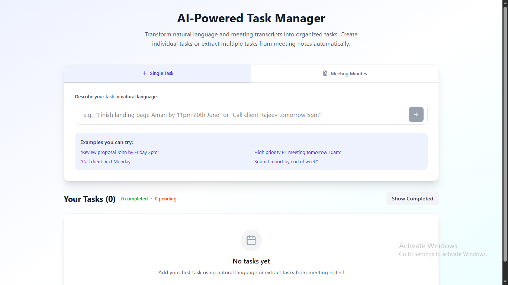
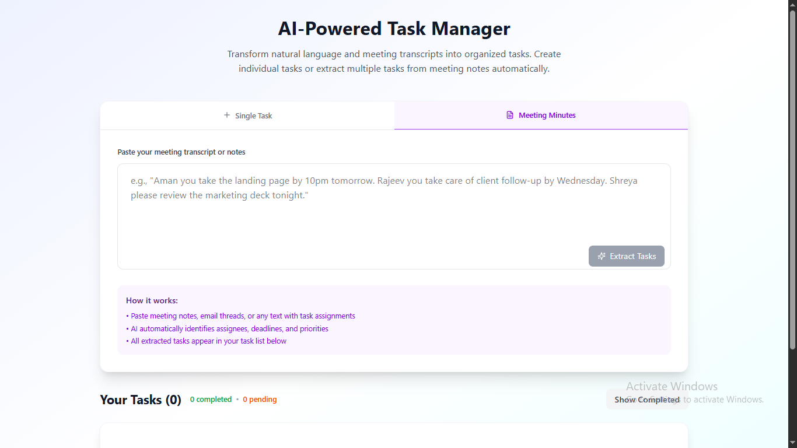
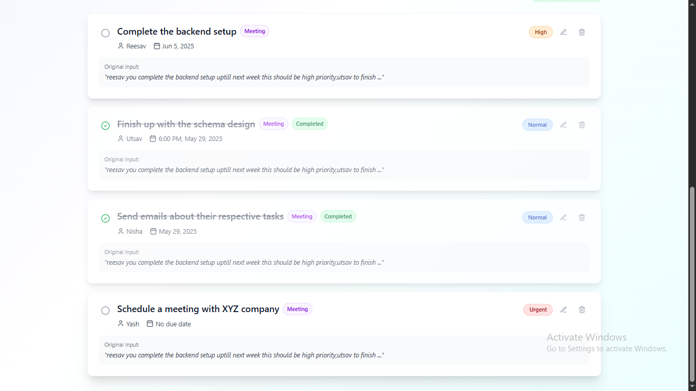

# AI-Powered Task Manager

Transform natural language and meeting transcripts into organized tasks with AI-powered parsing and intelligent extraction.

## 📸 Screenshots

### Single Task Creation



### Meeting Minutes Parser



### Task Management Board



## ✨ Key Features

### 🤖 AI-Powered Task Parsing

- **Natural Language Processing**: Convert casual descriptions into structured tasks
- **Meeting Transcript Analysis**: Extract multiple tasks from meeting notes automatically
- **Smart Assignment Detection**: Automatically identify assignees, deadlines, and priorities

### 📋 Intelligent Task Management

- **Auto-categorization**: Tasks tagged by source (Individual/Meeting)
- **Priority System**: P1-P4 priority levels with visual indicators
- **Completion Tracking**: Mark tasks complete with progress statistics
- **Real-time Editing**: Inline task editing with instant updates

### 🎯 Smart Features

- **Relative Date Parsing**: "tomorrow", "next Monday", "tonight" → actual dates
- **Time Recognition**: "5pm", "11:30am" → 24-hour format conversion
- **Priority Detection**: "urgent", "P1", "high priority" → structured priorities
- **Batch Processing**: Extract multiple tasks from single meeting transcript

## 🛠️ Tech Stack

- **Frontend**: React + Tailwind CSS + Lucide Icons
- **Backend**: Node.js + Express
- **AI**: OpenAI GPT-4 for natural language processing

## 📦 Installation & Setup

### Prerequisites

- Node.js 16+
- OpenAI API key

### 1. Clone Repository

```bash
git clone https://github.com/ReesavGupta/misogi-assignment-2.git
cd ai-task-manager
```

### 2. Backend Setup

```bash
cd backend
npm install
```

Create `.env` file:

```env
OPENAI_API_KEY=your_openai_api_key_here
PORT=4000
```

Start backend:

```bash
npm run dev
```

### 3. Frontend Setup

```bash
cd frontend
npm install
npm run dev
```

### 4. Access Application

- Frontend: `http://localhost:5173`
- Backend API: `http://localhost:4000`

## 🎯 Usage Examples

### Single Task Creation

```
Input: "Finish landing page Aman by 11pm 20th June"
Output: ✅ Task: "Finish landing page" | Assignee: Aman | Due: Jun 20, 11:00 PM | Priority: P3
```

### Meeting Minutes Processing

```
Input: "Aman you take the landing page by 10pm tomorrow. Rajeev handle client follow-up by Wednesday. Shreya review marketing deck tonight."

Output:
✅ 3 tasks extracted:
- "Take the landing page" → Aman (Tomorrow 10:00 PM)
- "Handle client follow-up" → Rajeev (Wednesday)
- "Review marketing deck" → Shreya (Tonight 6:00 PM)
```

## 🧠 AI Capabilities

### Natural Language Understanding

- **Task Extraction**: Identifies action items from conversational text
- **Person Recognition**: Detects assignee names in various sentence structures
- **Temporal Processing**: Converts relative dates/times to absolute values
- **Priority Inference**: Determines urgency from context clues

### Meeting Analysis

- **Multi-task Detection**: Extracts all individual assignments from group discussions
- **Context Awareness**: Maintains conversation flow understanding
- **Bulk Processing**: Handles long transcripts with multiple participants

## 📱 Features Overview

| Feature               | Description                         |
| --------------------- | ----------------------------------- |
| 🗣️ Natural Input      | Type tasks in plain English         |
| 📝 Meeting Parser     | Paste entire meeting transcripts    |
| 👤 Auto-Assignment    | AI detects who should do what       |
| ⏰ Smart Scheduling   | Converts "tomorrow" to actual dates |
| 🎯 Priority Detection | Identifies urgent vs normal tasks   |
| ✅ Task Completion    | Mark done with progress tracking    |
| 🏷️ Source Tagging     | Individual vs Meeting task origins  |
| 📱 Responsive Design  | Works on desktop and mobile         |

## 🔮 Future Enhancements

- **Calendar Integration**: Sync with Google Calendar/Outlook
- **Team Collaboration**: Multi-user workspaces
- **Notifications**: Email/Slack reminders for due dates
- **Analytics**: Task completion insights and team productivity metrics
- **Voice Input**: Speech-to-task conversion
- **Template System**: Pre-defined task templates for common workflows

## 🤝 Contributing

1. Fork the repository
2. Create feature branch (`git checkout -b feature/amazing-feature`)
3. Commit changes (`git commit -m 'Add amazing feature'`)
4. Push to branch (`git push origin feature/amazing-feature`)
5. Open Pull Request

---

**Built with ❤️ using AI-first approach for modern task management**
